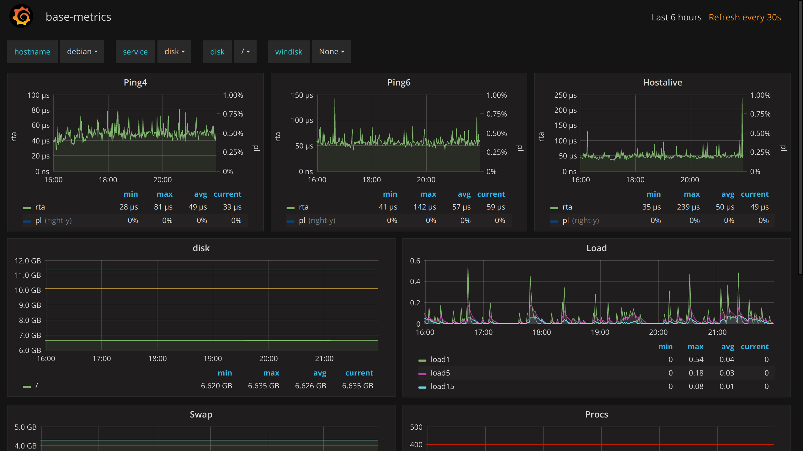
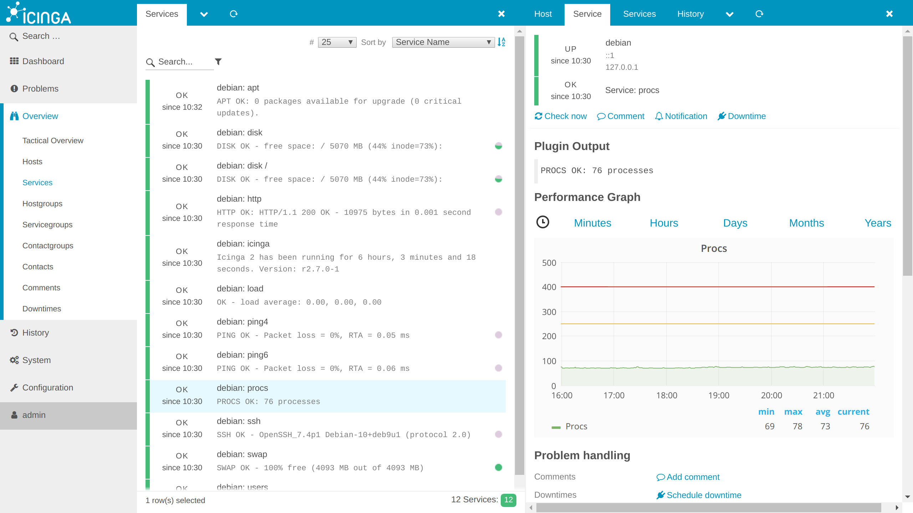
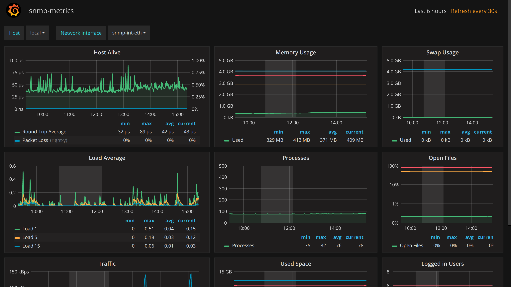
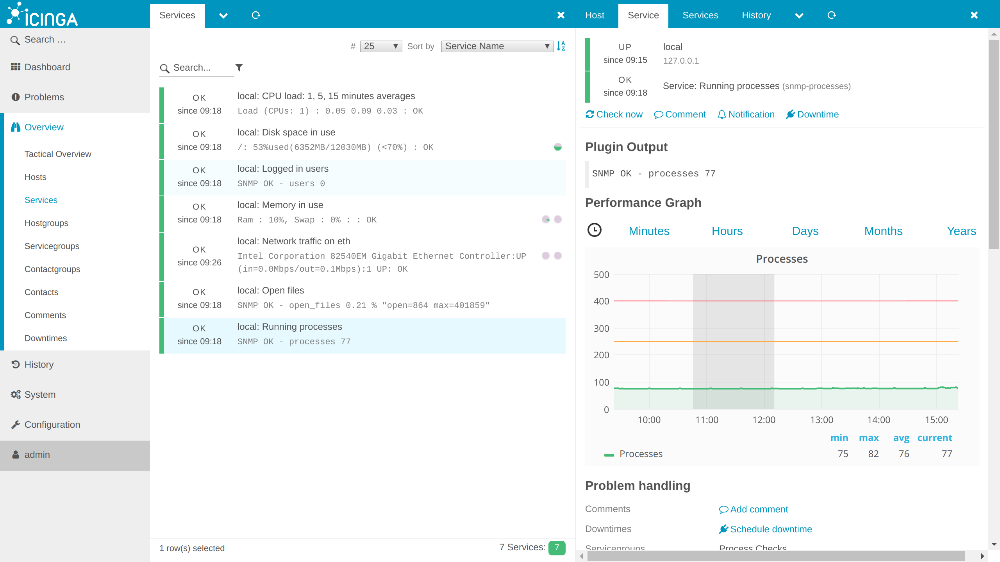

# Setup guide for Icinga2 with Grafana integration employing InfluxDB

## This guide uses Debian 9 "Stretch" as base

```bash
cat /etc/apt/sources.list

deb http://cdn.debian.net/debian/ stretch main
deb-src http://cdn.debian.net/debian/ stretch main

deb http://security.debian.org/debian-security stretch/updates main
deb-src http://security.debian.org/debian-security stretch/updates main

# stretch-updates, previously known as 'volatile'
deb http://cdn.debian.net/debian/ stretch-updates main
deb-src http://cdn.debian.net/debian/ stretch-updates main
```

## Setup Icinga2

#### Add source

```bash
wget -O - https://packages.icinga.com/icinga.key | apt-key add -

echo "deb http://packages.icinga.com/debian icinga-stretch main" > /etc/apt/sources.list.d/icinga.list
echo "deb-src http://packages.icinga.com/debian icinga-stretch main" >> /etc/apt/sources.list.d/icinga.list
```

#### Get packages

```bash
apt-get update
apt-get install icinga2 monitoring-plugins
```

#### Check service status

```bash
systemctl status icinga2

● icinga2.service - Icinga host/service/network monitoring system
   Loaded: loaded (/lib/systemd/system/icinga2.service; enabled; vendor preset: enabled)
   Active: active (running) since Fri 2017-07-28 13:46:00 BST; 16s ago
```

## Setup Icinga2 MySQL support

#### Get packages

```bash
apt-get install icinga2-ido-mysql mysql-server mysql-client
```
Questions during installation:
* Enable Icinga 2's ido-mysql feature? `No`
* Configure database for icinga2-ido-mysql with dbconfig-common? `No`

#### Secure MySQL installation

```bash
mysql_secure_installation
```

#### Create database and user

```bash
mysql -u root -p
```
```sql
CREATE DATABASE icinga2 CHARACTER SET utf8 COLLATE utf8_general_ci;
GRANT ALL ON icinga2.* TO 'icinga2'@'localhost' IDENTIFIED BY 'your-icinga2-pwd';
```

#### Import database schema

```bash
mysql -p icinga2 < /usr/share/icinga2-ido-mysql/schema/mysql.sql
```

#### Enable mysql module

```bash
icinga2 feature enable ido-mysql
```

#### Configure database access for icinga instance 

```bash
vim /etc/icinga2/features-available/ido-mysql.conf
```
```diff
-  password = "",
-  host = "localhost",
+  password = "your-icinga2-pwd",
+  host = "127.0.0.1",
```

## Setup Icinga2 web interface

#### Get packages

```bash
apt-get install icingaweb2 php php-intl php-imagick php-gd php-mysql php-curl php-mbstring
```

#### Set PHP default timezone 

```bash
vim /etc/php/7.0/apache2/php.ini
```
```diff
-;date.timezone =
+date.timezone = Europe/Paris
```
```bash
systemctl restart apache2
```

#### Create database and user

```bash
mysql -u root -p
```
```sql
CREATE DATABASE icingaweb2 CHARACTER SET utf8 COLLATE utf8_general_ci;
GRANT ALL ON icingaweb2.* TO 'icingaweb2'@'localhost' IDENTIFIED BY 'your-icingaweb2-pwd';
```

#### Import database schema

```bash
mysql -p icingaweb2 < /usr/share/icingaweb2/etc/schema/mysql.schema.sql
```

#### Enable external command pipe

```bash
icinga2 feature enable command
systemctl restart icinga2
```

#### Create setup token

```bash
icingacli setup config directory --group icingaweb2
icingacli setup token create
```

#### Setup using web interface

http://your-public-host.name/icingaweb2/setup

Setup Token: `Your Token`  
*Next*  
  
Modules enabled: `Monitoring`   
*Next*  
  
Authentication Type: `Database`  
*Next*  
  
Resource Name: `icingaweb_db`  
Database Type: `MySQL`  
Host: `127.0.0.1`  
Port: `3306`  
Database Name: `icingaweb2`  
Username: `icingaweb2`  
Password: `your-icingaweb2-pwd`  
Character Set: `utf8`  
Persistent: `False`  
Use SSL: `False`  
*Next*  
  
Backend Name: `icingaweb2`  
*Next*  
  
Username: `admin`  
Password: `your-admin-pwd`  
Repeat password: `your-admin-pwd`  
*Next*  
  
Show Stacktraces: `Yes`  
User Preference Storage Type: `Database`  
Logging Type: `Syslog`  
Logging Level: `Error`  
Application Prefix: `icingaweb2`  
Facility: `user`  
*Next*  
  
Backend Name: `icinga`  
Backend Type: `IDO`  
*Next*  
  
Resource Name: `icinga_ido`  
Database Type: `MySQL`  
Host: `127.0.0.1`  
Port: `3306`  
Database Name: `icinga2`  
Username: `icinga2`  
Password: `your-icinga2-pwd`  
Character Set: `utf8`  
Persistent: `False`  
Use SSL: `False`  
*Next*  
  
Transport Name: `icinga2`  
Transport Type: `Local Command File`  
Command File: `/var/run/icinga2/cmd/icinga2.cmd`  
*Next*  
  
Protected Custom Variables: `*pw*,*pass*,community`  
*Next*  

## Setup graphing module Grafana

#### Get packages

```bash
apt-get install influxdb influxdb-client adduser libfontconfig

wget https://s3-us-west-2.amazonaws.com/grafana-releases/release/grafana_4.4.3_amd64.deb
dpkg -i grafana_4.4.3_amd64.deb
rm  grafana_4.4.3_amd64.deb
```

#### Enable and start Grafana service

```bash
systemctl daemon-reload
systemctl enable grafana-server
systemctl start grafana-server
```

#### Create database and user

```bash
influx
```
```sql
CREATE DATABASE icinga2;
CREATE USER icinga2 WITH PASSWORD 'your-icinga2-pwd';
```

#### Send performance data to influx

```bash
icinga2 feature enable influxdb

vim /etc/icinga2/features-enabled/influxdb.conf
```
```diff
-  //host = "127.0.0.1"
-  //port = 8086
-  //database = "icinga2"
-  //flush_threshold = 1024
-  //flush_interval = 10s
-  //host_template = {
-  //  measurement = "$host.check_command$"
-  //  tags = {
-  //    hostname = "$host.name$"
-  //  }
-  //}
-  //service_template = {
-  //  measurement = "$service.check_command$"
-  //  tags = {
-  //    hostname = "$host.name$"
-  //    service = "$service.name$"
-  //  }
-  //}
+  host = "127.0.0.1"
+  port = 8086
+  database = "icinga2"
+  username = "icinga2"
+  password = "your-icinga2-pwd"
+  enable_send_thresholds = true
+  enable_send_metadata = true
+  flush_threshold = 1024
+  flush_interval = 10s
+  host_template = {
+    measurement = "$host.check_command$"
+    tags = {
+      hostname = "$host.name$"
+    }
+  }
+  service_template = {
+    measurement = "$service.check_command$"
+    tags = {
+      hostname = "$host.name$"
+      service = "$service.name$"
+    }
+  }
```
```bash
systemctl restart icinga2
```

#### Navigate to Grafana web interface

Url: `http://your-public-host.name:3000`  
Username: `admin`  
Password: `admin`  

#### Create new Grafana datasource

Add Datasource: http://your-public-host.name:3000/datasources/new?gettingstarted

Name: `Influx`  
Type: `InfluxDB`  
Default: `Yes`  
  
Url: `http://127.0.0.1:8086`  
Access: `proxy`  
  
Database: `icinga2`  
User: `icinga2`  
Password: `your-icinga2-pwd`

#### Import Grafana dashboard

Import Dashboard: http://your-public-host.name:3000/dashboard/new?editview=import&orgId=1

Paste JSON from https://raw.githubusercontent.com/Mikesch-mp/icingaweb2-module-grafana/v1.1.8/dashboards/influxdb/base-metrics.json



#### Add Icinga Web Grafana module

```bash
cd /usr/share/icingaweb2/modules
wget -qO- https://github.com/Mikesch-mp/icingaweb2-module-grafana/archive/v1.1.8.tar.gz | tar xvz
mv icingaweb2-module-grafana-1.1.8 grafana
mkdir /etc/icingaweb2/modules/grafana
```

#### Configure Icinga Web Grafana module

Module configuriation ([config.ini](configs/icingaweb2-grafana-config.ini))
```bash
vim /etc/icingaweb2/modules/grafana/config.ini
```

Graph configuriation ([graphs.ini](configs/icingaweb2-grafana-graphs.ini))
```bash
vim /etc/icingaweb2/modules/grafana/graphs.ini
```

#### Enable anonymous access

```bash
vim /etc/grafana/grafana.ini
```
```diff
[auth.anonymous]
# enable anonymous access
-;enabled = false
+enabled = true
```
```bash
systemctl restart grafana-server
```

#### Remove scrollbars from iframe

```bash
vim /usr/share/icingaweb2/modules/grafana/library/Grafana/ProvidedHook/Grapher.php
```
```diff
-                $iframehtml = '<iframe src="%s://%s/dashboard-solo/%s/%s?var-hostname=%s&var-service=%s%s&panelId=%s&orgId=%s&theme=%s&from=now-%s&to=now" alt="%s" height="%d" frameBorder="0" style="width: 100%%;"></iframe>';
+                $iframehtml = '<script>$(".module-grafana").parent().parent().data("icingaRefresh", 30);</script><iframe src="%s://%s/dashboard-solo/%s/%s?var-hostname=%s&var-service=%s%s&panelId=%s&orgId=%s&theme=%s&from=now-%s&to=now" alt="%s" height="%d" frameBorder="0" scrolling="no" style="width: 100%%;"></iframe>';
```

#### Enable Icinga Web Grafana module

```bash
icingacli module enable grafana
chown -R www-data:icingaweb2 /etc/icingaweb2
```

#### Disable graphing for commands without graphs

Go to the service configuration and set the custom var `grafana_graph_disable` for all services, which have no Grafana graph: `ssh`, `http`, `disk`, and `icinga`.

```bash
vim /etc/icinga2/conf.d/services.conf
```
```diff
+  vars.grafana_graph_disable = true
```

```bash
systemctl restart icinga2
```



## Setup SNMP daemon

#### Get packages

```bash
apt-get install snmp snmpd libsnmp-dev
```

#### Configure and setup user

```bash
systemctl stop snmpd
net-snmp-config --create-snmpv3-user -ro -A "your-secret-auth-pwd" -X "your-secret-priv-pwd" -a SHA -x AES snmp
```

```bash
vim /etc/snmp/snmpd.conf
```
```diff
- rocommunity public  default    -V systemonly
- rocommunity6 public  default   -V systemonly
+# rocommunity public  default    -V systemonly
+# rocommunity6 public  default   -V systemonly

- rouser   authOnlyUser
+# rouser   authOnlyUser

- trapsink     localhost public
+# trapsink     localhost public

-iquerySecName   internalUser
-rouser          internalUser
-defaultMonitors          yes
-linkUpDownNotifications  yes
+#iquerySecName   internalUser
+#rouser          internalUser
+#defaultMonitors          yes
+#linkUpDownNotifications  yes
```
```bash
systemctl start snmpd
```

#### Add custom check to SNMP

Script to monitor open file handles: [check_open_files](plugins/check_open_files)

```bash
apt-get install bc
mkdir -p /usr/local/lib/nagios/plugins

vim /usr/local/lib/nagios/plugins/check_open_files
chmod +x /usr/local/lib/nagios/plugins/check_open_files
```

```bash
vim /etc/snmp/snmpd.conf
```
```diff
- extend    test1   /bin/echo  Hello, world!
- extend-sh test2   echo Hello, world! ; echo Hi there ; exit 35
-#extend-sh test3   /bin/sh /tmp/shtest
+ extend open_files /usr/local/lib/nagios/plugins/check_open_files
```
```bash
systemctl restart snmpd
```

#### Test it

```bash
snmpwalk -v3 -l authPriv -u snmp -a SHA -A "your-secret-auth-pwd" -x AES -X "your-secret-priv-pwd" 127.0.0.1 .1.3.6.1.4.1.8072.1.3.2
```

Output:
```bash
...
iso.3.6.1.4.1.8072.1.3.2.4.1.2.10.111.112.101.110.95.102.105.108.101.115.1 = STRING: "0.27"
iso.3.6.1.4.1.8072.1.3.2.4.1.2.10.111.112.101.110.95.102.105.108.101.115.2 = STRING: "open=1088 max=401859"
```

## Monitor SNMP hosts

#### Get packages

```bash
apt-get install nagios-snmp-plugins libdigest-hmac-perl
```

#### Configure Icinga and Icinga Web Grafana module

Hosts configuriation ([hosts.conf](conf.d/hosts.conf))
```bash
vim /etc/icinga2/conf.d/hosts.conf
```

Services configuriation ([services.conf](conf.d/services.conf))
```bash
vim /etc/icinga2/conf.d/services.conf
```

Groups configuriation ([groups.conf](conf.d/groups.conf))
```bash
vim /etc/icinga2/conf.d/groups.conf
```

Graph configuriation ([graphs.ini](configs/icingaweb2-grafana-snmp-graphs.ini))
```bash
vim /etc/icingaweb2/modules/grafana/graphs.ini
```

```bash
systemctl restart icinga2
```

#### Get a list of network interfaces

In case you experience issues with the network interface (`Unknown interface eth0`), use the following command to get a list of available network interfaces:

```bash
/usr/lib/nagios/plugins/check_snmp_int.pl -x your-secret-auth-pwd -p 161 -n eth0 -l snmp -X your-secret-priv-pwd -L sha,aes -H 127.0.0.1 -v
```

#### Import Grafana SNMP dashboard

Import Dashboard: http://your-public-host.name:3000/dashboard/new?editview=import&orgId=1

Use the [grafana-snmp-dashboard](configs/grafana-snmp-dashboard.json).

#### Congratulations you successfully completed this guide




